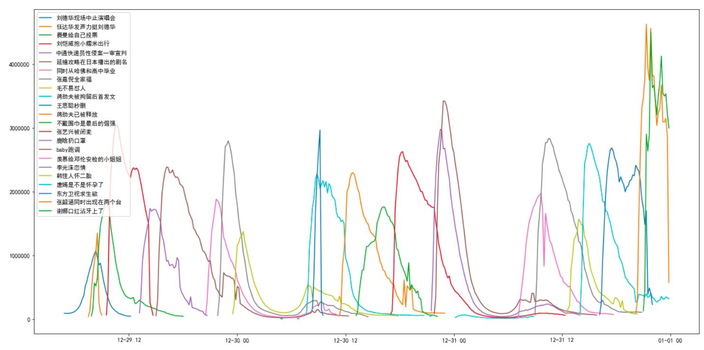

# Crawler and Analysis for hot topics on Weibo

Designed By: Xiaochi (George) Li  
Dec.2018

[Download Data](./data)

## Crawler Part
This program([*weibo_hot_crawler.py*](./weibo_hot_crawler.py)) fetches the hot words and heat index from Hot Weibo(热搜榜） (https://s.weibo.com/top/summary?cate=realtimehot),
read count and discussion count from Weibo Search（关键词搜索）(https://s.weibo.com/weibo?q) every 10 minutes
It then stores the information into a CSV file.

CSV contains: 10 columns(index, year, month, day, hour, minute, key_word, number, read, discuss)

|Column name|Explanation|
|----|----|
|index（序号）| the current rank of the key_word|
|year|-|
|month|-|
|day|-|
|hour|-|
|minute|-|
|key_word（关键词）| the hot word (in chinese, encoding: utf-8)|
|number（热搜指数）| the heat index|
|read(阅读）| the read count|
|discussion（讨论）| the discussion count|

## Analysis Part
See [*Analyse.ipynb*](./Analyse.ipynb)

## 2019-01-04: Crawler part is complete, wait for analysis.